# Predicting Spotify Song Popularity 
Capstone Project for Galvanize Data Science Immersive 

by Matt Devor

# Introduction
Music has always been an integral part of my life. I can still remember the first time I heard the band Phish in high school, and from there something ‘clicked’, and my musical tastes branched out widely from just alt-rock to jazz, funk, progressive rock, bluegrass, and many other genres. 

However, my personal musical tastes often differ quite drastically from what is popular in the mainstream. As such, I have always been fascinated by **why** certain songs are popular. I.e., what is it about certain songs that causes them to have billions of listens?


Spotify is a digital music service that enables users to remotely source millions of different songs on various record labels from a laptop, smartphone or other device. To recommend new music to users, and to be able to internally classify songs, Spotify assigns each song values from 13 different attributes/features. These features are mostly numerical values, but include some categorical data as well (the key the song is in, for instance). Spotify also assigns each song a popularity score, based on total number of clicks/listens. 

I discovered a Kaggle dataset of 100,000+ songs from Spotify (located [here](https://www.kaggle.com/tomigelo/spotify-audio-features/home)), which includes a popularity score and set of metrics/attributes for each song. From looking through that data, I thought there might be a very interesting opportunity to take a deep dive into what attributes make a song popular. 

# Strategy and Process
- Overview of Data
- Exploratory Data Analysis
- Linear Regression to predict popularity score
- Undersampling
- Logistic Regression to predict popular/not popular
- Be able to **accurately** predict if a song will be popular or not!

# Overview of the Data
- This dataset has 116,191 unique songs.
- There are 32,105 unique artists.
- 17 attributes for each song, 13 of them numerical.
- Dependent variable is the **Popularity Score** - a value between 0 and 100 based on total recent streams.

### Descriptions of the 13 unique numerical attributes for each song:
|Attribute | Mean | Std Dev |Description|
|--- | --- | --- | --- |
|1 - Acousticness (float) |0.34|0.34| A confidence measure from 0.0 to 1.0 of whether the track is acoustic.|
|2 - Danceability (float)|0.58|0.18| Danceability describes how suitable a track is for dancing based on a combination of musical elements including tempo, rhythm stability, beat strength, and overall regularity.|
|3 - duration_ms (int)| 212546| 124320| Duration of the track in ms|
|4 - energy (float)|0.57 |0.26 | Energy is a measure from 0.0 to 1.0 and represents a perceptual measure of intensity and activity. Typically, energetic tracks feel fast, loud, and noisy.|
|5 - instrumentalness (float) |0.23 |0.36 | Predicts whether a track contains no vocals. “Ooh” and “aah” sounds are treated as instrumental in this context. 
|6 - key (int)|5.24| 3.60| The estimated overall key of the track.|
|7 - liveness (float)|0.19 | 0.17 |Detects the presence of an audience in the recording. Higher liveness values represent an increased probability that the track was performed live.| 
|8 - loudness| -9.94 | 6.50| The overall loudness of a track in decibels (dB)
|9 - mode (int)| 0.61| 0.49| Mode indicates the modality (major or minor) of a track, the type of scale from which its melodic content is derived.|
|10 - speechiness (float)| 0.11| 0.12| Speechiness detects the presence of spoken words in a track. The more exclusively speech-like the recording (e.g. talk show, audio book, poetry), the closer to 1.0 the attribute value.
|11 - tempo (int)|119.60 |30.15 | The overall estimated tempo of a track in beats per minute (BPM). In musical terminology, tempo is the speed or pace of a given piece and derives directly from the average beat duration.
|12 - time signature (int)| 3.88| 0.51| An estimated overall time signature of a track.| 
|13 - valence (float) | 0.44 | 0.26| A measure from 0.0 to 1.0 describing the musical positiveness conveyed by a track. Tracks with high valence sound more positive (e.g. happy, cheerful, euphoric), while tracks with low valence sound more negative (e.g. sad, depressed, angry).| 

# Exploratory Data Analysis:
I first took a look at how the popularity scores were distributed, and one thing I noticed right away is that most of the songs are not very popular. In fact, the majority of them have a popularity score less than 40, with the mean popularity score at a value of 24. As such, it appears that this dataset is quite unbalanced, in that only a small proportion of the songs (less than 10%) have a popularity score > 55. The following figure illustrates this point:

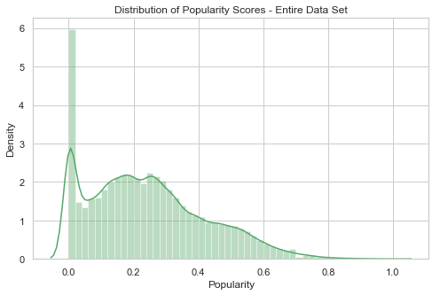

As I continued looking into the dataset as a whole, I realized that this was probably going to be a difficult problem for linear regression to solve, simply due to the fact that many of the features do not appear to have much correlation with the target variable. Here are some selected scatter plots of features vs. popularity. Popularity scores > 55 have been hued to add contrast.

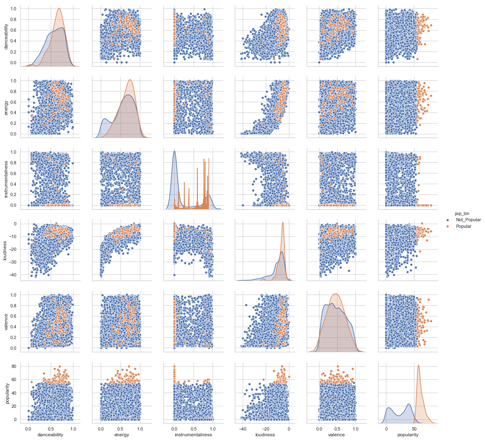

This can be also be illustrated by setting an arbitrary popularity cutoff score of 55, and plotting the means of some of the independent variables, as well has their distributions. As the figure below show, the means of independent variables between 'popular' and 'unpopular' songs are quite similar:

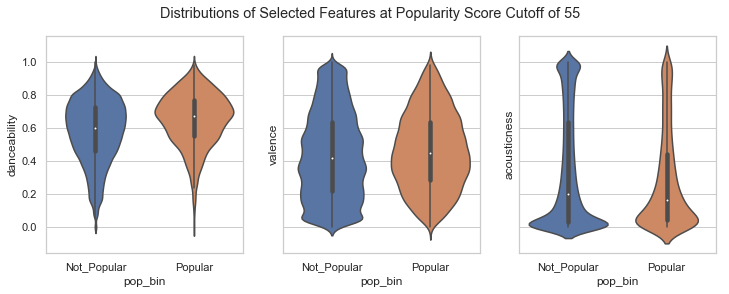
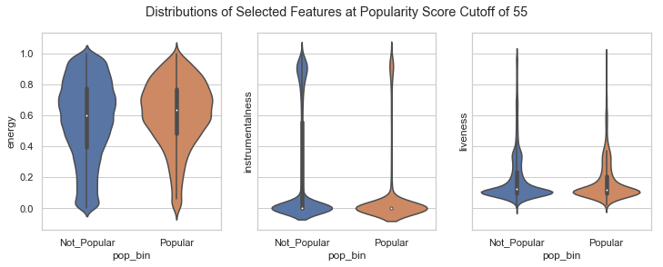

I also wanted to take a look at any potential multicolinearity issues within my independent variables, and used sns to make a nice heatmap of those, shown below. Overall, there aren't too many independent variables with high correlation values, but energy/loudness could potentially cause problems. One thing potentially worrying about this though: not much correlation b/w independent variables and popularity. This could have pretty big implications for fitting a linear model.
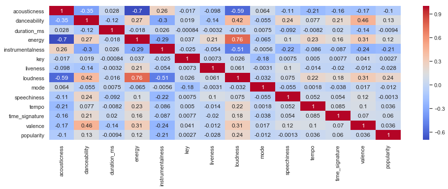

## EDA Takeaways
- Distribution of dependent variable is quite unbalanced, and this will make it difficult for a model to predict the very popular songs, because there are less popular songs to train on.
  - Only 0.2% of songs have a popularity score > 80.
  - Undersampling might be crucial to creating a good model.
- No actual *null* values, but plenty of zeros for each feature, which could be interpreted as missing data.
- Almost 1/10 of the songs have a popularity score of zero. This could cause problems when training the model
- Heatmap shows some potential multicollinearity between energy and valence.

# First Model: Linear Regression
For my first modeling effort, I decided to go with a linear regression. This was initially chosen because I wanted to predict the exact popularity score a song will have, and becuase I noticed "some" correlation between the independent variables (the 13 attributes), and the dependent variable (popularity). For this process, I first split the entire dataset using train-test-split, holding out 20% of the data to eventually be used as a test. I then went through a systematic process of adding and removing features, transforming features, and filtering the data, attempting to bring up the abysmally low R^2 values I was getting.

The results of this first model were not good, as the R^2 was only around 0.08, no matter how much feature engineering I did. I also tried completely removing songs with a popularity score of zero, but that did not seem to help increase my R^2 values at all. I realize that R^2 does not tell the entire story, but was just trying to use that as an initial metric to gauge my model.

Results of the first model are as follows:

```
                            OLS Regression Results
==============================================================================
Dep. Variable:             popularity   R-squared:                       0.077
Model:                            OLS   Adj. R-squared:                  0.077
Method:                 Least Squares   F-statistic:                     560.6
Date:                Wed, 13 Feb 2019   Prob (F-statistic):               0.00
Time:                        13:21:32   Log-Likelihood:            -3.7234e+05
No. Observations:               87279   AIC:                         7.447e+05
Df Residuals:                   87265   BIC:                         7.448e+05
Df Model:                          13
Covariance Type:            nonrobust
====================================================================================
                       coef    std err          t      P>|t|      [0.025      0.975]
------------------------------------------------------------------------------------
const               32.2695      0.711     45.408      0.000      30.877      33.662
acousticness         1.5803      0.251      6.296      0.000       1.088       2.072
danceability         5.6027      0.403     13.908      0.000       4.813       6.392
duration_ms      -1.743e-06   4.86e-07     -3.588      0.000    -2.7e-06   -7.91e-07
energy              -4.2402      0.432     -9.813      0.000      -5.087      -3.393
instrumentalness    -6.1092      0.196    -31.223      0.000      -6.493      -5.726
key                 -0.0215      0.016     -1.308      0.191      -0.054       0.011
liveness            -2.0761      0.371     -5.593      0.000      -2.804      -1.349
loudness             0.6431      0.017     38.793      0.000       0.611       0.676
mode                -0.2780      0.122     -2.273      0.023      -0.518      -0.038
speechiness         -5.8672      0.502    -11.686      0.000      -6.851      -4.883
tempo               -0.0016      0.002     -0.777      0.437      -0.005       0.002
time_signature       0.6063      0.118      5.124      0.000       0.374       0.838
valence             -4.7072      0.268    -17.573      0.000      -5.232      -4.182
==============================================================================
Omnibus:                     3421.189   Durbin-Watson:                   1.994
Prob(Omnibus):                  0.000   Jarque-Bera (JB):             3708.239
Skew:                           0.490   Prob(JB):                         0.00
Kurtosis:                       2.756   Cond. No.                     3.30e+06

Warnings:
[1] Standard Errors assume that the covariance matrix of the errors is correctly specified.
[2] The condition number is large, 3.3e+06. This might indicate that there are
strong multicollinearity or other numerical problems.
```

Here's a plot of true vs. predicted popularity values from this model. As can be seen, the model is having a very difficult time predicting the very high (and low) popularity scores.


Even though the R^2 is low, there are still some important takeaways from this model, as we can take a look at the magnitudes of the coefficient values.
The most important features appear to be:
- danceability
- energy
- instrumentalness
- speechiness
- valence

Features not moving the needle much:
- key
- mode
- tempo
- time_signature

# Undersampling
As mentioned above, the biggest problem with this initial approach was the fact that with such unbalanced data, predicting the highest and lowest popularity values was extremely difficult.
However, after discussing this problem with some colleagues, we decided that undersampling the data might be a perfect approach to an unbalanced dataset such as this.

Undersampling basically allows one to balance the ratio of important/unimportant dependent variable values, in an attempt to allow the model to see much more values we care about. This is accomplished by first taking a subset of the data that contains all the important dependent variable values, in this case all records with a **high** popularity score. From here on out, this is defined as the **cutoff** point.

Basically, all values with a popularity score >= the cutoff are included in the model, and then the data with popularity scores below the cutoff point is randomly sampled, so that there is a 50/50 split of popular/unpopular songs in the final dataset. This process is shown in this figure:

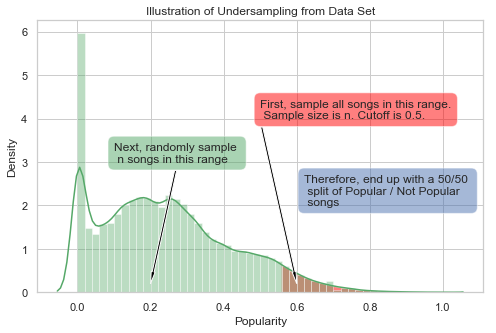

The next part of my capstone was mainly focused on how R^2 values and variable coefficients changed as the cutoff value changed. I basically followed this process in order to evaluate undersampled models at various cutoff levels:

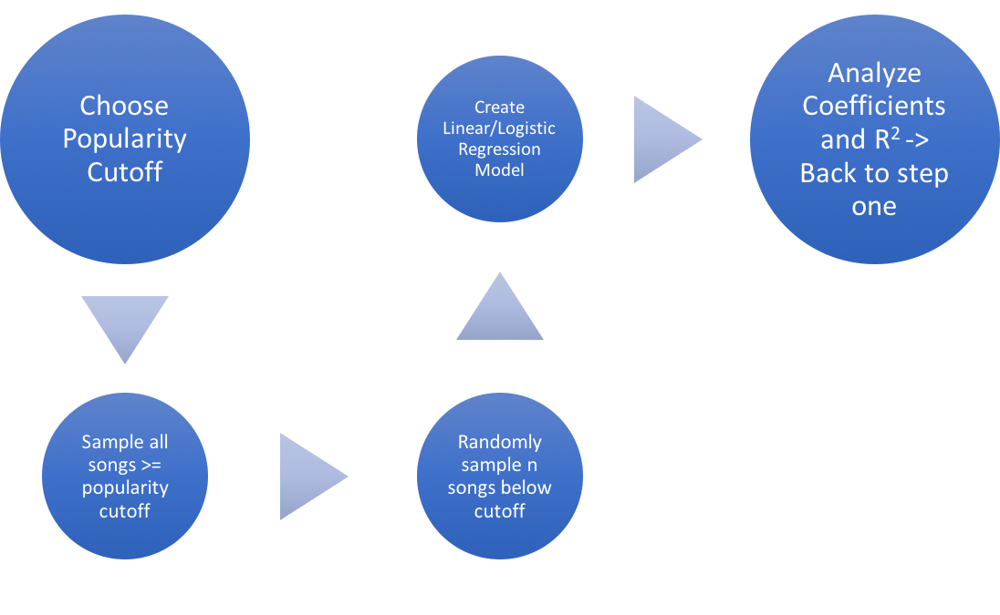

I found it very fascinating how much a a difference undersampling had on the accuracy of my model, but there was definitely a tradeoff: as the cutoff grew, the total number of samples got smaller, which makes sense because there aren't many popular songs in the dataset. As such, the p-values of quite a few of my independent variables started showing that they were becoming less significant. So, even though R^2 was getting better, the possible ranges for my coefficients were getting larger.

This table illustrates this point:

|Model | R^2 | Danceability Coeff| Danceability p-value|Danceability Coeff Range|
| --- | --- | --- | --- | ---|
|First Linear Model | 0.08 | 5.64 | 0.00 | 4.96 - 6.32|
|Cutoff = 55| 0.16 | 17.47 | 0.00 | 14.84 - 20.10|
|Cutoff = 65| 0.22 | 23.70 | 0.00 | 18.48 - 28.93|
|Cutoff = 75| 0.29 | 38.88 | 0.00 | 25.93 - 51.83|
|Cutoff = 80| 0.32 | 42.90 | 0.00 | 21.93 - 63.86|
|Cutoff = 85| 0.38 | 32.53 | 0.062 | -1.68 - 66.75|
|Cutoff = 90| 0.42 | 60.99 | 0.105 | -13.31 - 135.30|

These plots show how my model was capturing more of the higher popularity scores as the cutoff increased:
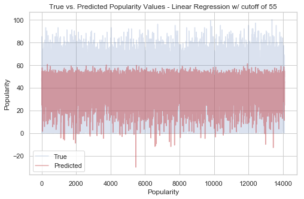
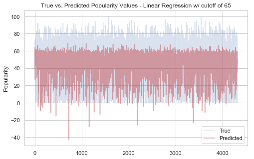
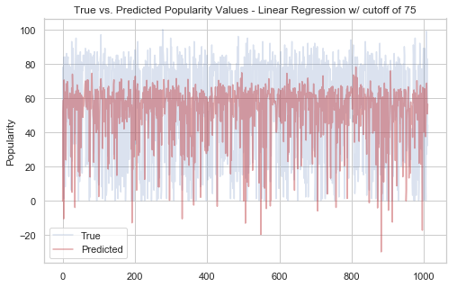
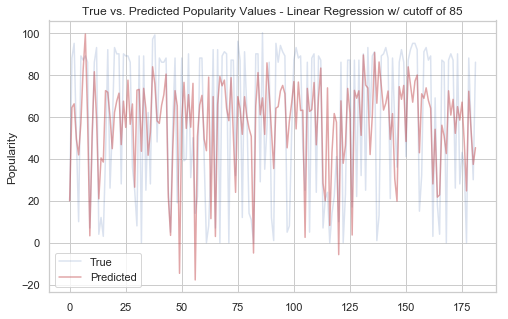

The final linear regression model that I decided to evaluate used a cutoff of 75, as this seemed to have a good balance between a higher R^2 value, but still retained the significance of my most important predictors. Here are the metrics for that model:
```
                            OLS Regression Results                            
==============================================================================
Dep. Variable:             popularity   R-squared:                       0.285
Model:                            OLS   Adj. R-squared:                  0.276
Method:                 Least Squares   F-statistic:                     30.63
Date:                Wed, 13 Feb 2019   Prob (F-statistic):           4.41e-64
Time:                        15:23:27   Log-Likelihood:                -4741.6
No. Observations:                1012   AIC:                             9511.
Df Residuals:                     998   BIC:                             9580.
Df Model:                          13                                         
Covariance Type:            nonrobust                                         
====================================================================================
                       coef    std err          t      P>|t|      [0.025      0.975]
------------------------------------------------------------------------------------
const               63.0669     12.205      5.167      0.000      39.117      87.017
acousticness         0.2446      4.023      0.061      0.952      -7.651       8.140
danceability        38.8808      6.599      5.892      0.000      25.932      51.830
duration_ms_std     -0.6473      0.846     -0.765      0.445      -2.308       1.014
energy             -24.7469      7.168     -3.453      0.001     -38.812     -10.681
instrumentalness   -30.3175      3.874     -7.826      0.000     -37.919     -22.716
key                  0.0467      0.233      0.200      0.841      -0.411       0.504
liveness             6.1127      6.227      0.982      0.327      -6.107      18.333
loudness_std         9.3579      1.675      5.585      0.000       6.070      12.646
mode                 1.3648      1.742      0.784      0.433      -2.053       4.783
speechiness        -25.3640      8.009     -3.167      0.002     -41.081      -9.647
tempo_std            1.4278      0.854      1.671      0.095      -0.249       3.105
time_signature      -2.6945      2.605     -1.034      0.301      -7.806       2.417
valence            -10.4326      4.108     -2.539      0.011     -18.494      -2.371
==============================================================================
Omnibus:                      109.976   Durbin-Watson:                   1.997
Prob(Omnibus):                  0.000   Jarque-Bera (JB):               85.386
Skew:                          -0.616   Prob(JB):                     2.87e-19
Kurtosis:                       2.287   Cond. No.                         118.
==============================================================================

Warnings:
[1] Standard Errors assume that the covariance matrix of the errors is correctly specified.
```

QQ plot for this model:

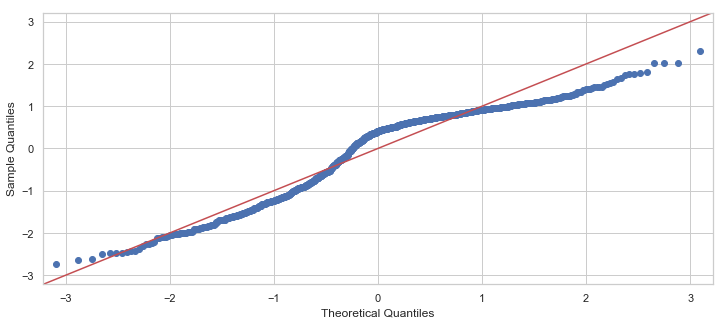

Studentized residuals for this model:

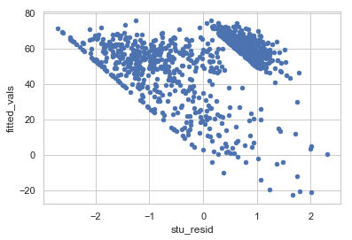

Using train/test split, I also calculated this model's RMSE values for both the training and testing data sets. These values were still quite high, which I guess can be expected for an R^2 < 0.30.

RMSE for training set 26.23

RMSE for test set 26.31

So, overall, not a great model, and certainly not one you'd want to rely on for an accurate popularity score. However, as we saw in the first model, the most important/significant features still appear to be:
- danceability 
- energy
- instrumentalness
- loudness 
- speechiness
- valence

Overall, it seems that songs with a high danceability value are more likely to be popular, while energy and instrumentalness can lower the score. If a song has too high of a level of speechiness, that will bring down the score as well, as will too high of a valence score, or if a song is too "happy". 

# Second Model: Logistic Regression
Since my linear regression model wasn't as accurate as I was hoping for, I decided to see if I could create a logistic regression model, in order to predict 'Popular' or 'Not Popular', using samples taken from my larger dataset, sampled by the cutoff methodology. Basically, all songs that had a popularity score at or above the popularity score cutoff were flagged as having a popularity binary value of 1, and all songs below the cutoff were flagged as having a 0. The process of setting the cutoff, sampling, running the logistic regression, and then evaluating the outputs of the model was repeated for several different cutoff points, and I ended up with some promising results.

For this model, I wasn't really expecting to see anything better than a guess, based on the results of the linear regression, but my results at every cutoff level showed continuing improvement as the cutoff was increased.

The following ROC plots show the two extremes of the cutoffs I looked at:


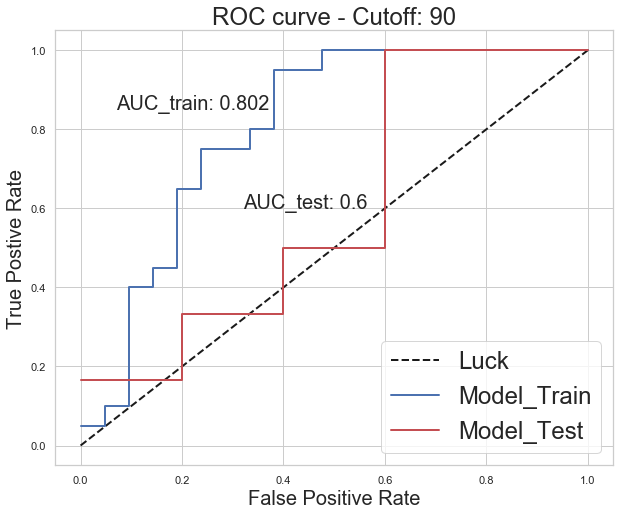

From looking at the above ROC plots, I then decided to see how my auc, accuracy, precision, and recall changed as the cutoff changed, and used those values to determine the optimal cutoff level.
The following plot show that relationship:

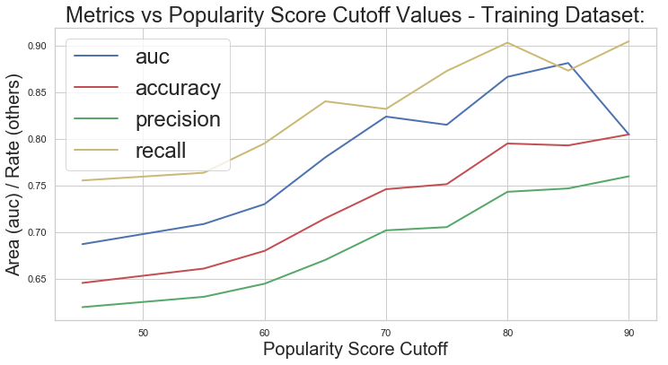

I ended up deciding on a cutoff of 80, as after that most of the metrics start decreasing, and I also noticed that, as seen in the linear regression, my features were becoming less significant as the cutoff increased.

Confusion Matrix for Training dataset:
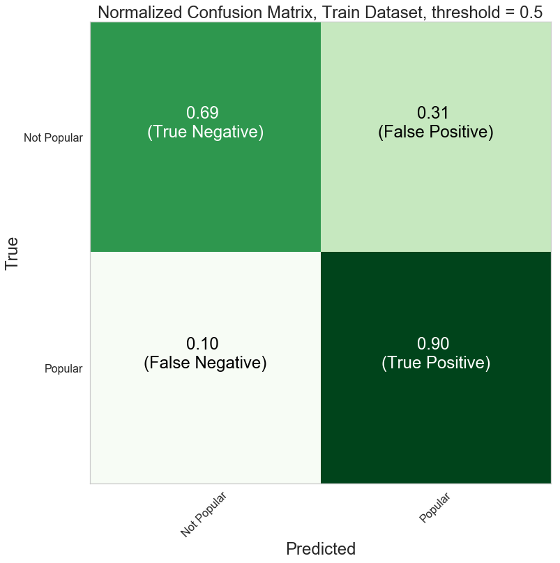

Confusion Matrix for Test dataset:
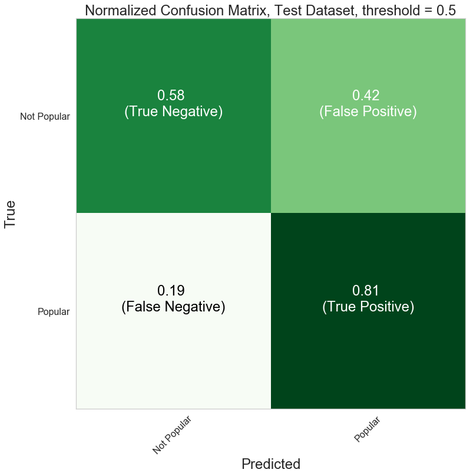

Equations for Logistic Regression Metrics:
- Auc = Total area under ROC curve
- Accuracy  = Σ True positive + Σ True negative / Σ Total population
- Precision = Σ True positive / Σ Predicted condition positive
- Recall / TPR / Sensitivity = Σ True positive / Σ Condition positive

Metrics for final logistic regression model at a threshold of 0.5:

|Metric | Training Dataset |  Test Dataset|
| --- | --- | --- |
|Auc| 0.86 | 0.79|
|Accuracy| 0.80| 0.69|
|Precision|  0.75|0.62|
|Recall| 0.90 |0.81|


ROC curve for best logistic regression model:
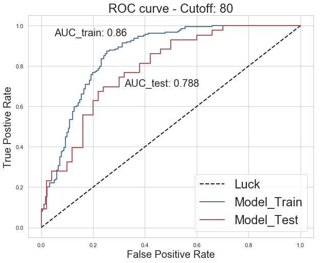

## Selected songs from model predictions:
- Song that my model predicted was popular, that is indeed popular: [True Positive](https://youtu.be/bIv16itYi_0?t=46)

- Song that my model predicted was popular, that is not actually popular, at least not on Spotify. 
(Note the model was 68% sure this song had a popularity score of 80 or greater!): 
[False Positive](https://www.youtube.com/watch?v=3uTirCgKEQ8)

- Song that my model predicted was not popular, that is indeed popular:
[False Negative](https://youtu.be/-pMa_wfv7_o?t=13)

- Song that my model predicted was not popular, that is not popular [True Negative](https://youtu.be/ZgXCphQGNg4?t=16)

### Final Coefficients and Interpretation:
Overall it seems that danceability is still the most important feature when predicting popularity. Energy and instrumentalness were important predictors as well, but with negative magnitudes, indicating that, all else equal, a one-unit increase in either of those will result in a decrease in the odds of a song being popular. Loudness also seems to be a big indicator, which is a bit surprising, and is potentially more indicative of the db level in which most "popular" songs are mixed at. Below is a plot of final coefficient magnitudes. I chose to do absolute magnitudes instead of exponentiated magnitudes, in order to better illustrate the direction an increase in each coefficient will have on the odds of a song being popular.

| Feature| Coefficient Value|
|---|---|
|acousticness | 0.53|
danceability | 3.20|
duration_ms | 0.20|
energy | -2.24|
instrumentalness |-2.10|
key |0.01|
liveness |-1.01|
loudness |1.89|
mode |-0.06|
speechiness |0.14|
tempo |-0.05|
time_signature|0.01|
valence |-0.72|

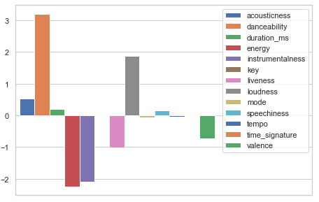

All else equal, a 0.1 unit increase in a feature value will cause the following change in the probability of the song being popular (in this case, having a popularity score >= 80):

| Feature| Probability Delta|
|---|---|
|Danceability| +8%|
|energy| -5%| 
|instrumentalness| -5%| 
|liveness| -2%|
|loudness|+5%|
|valence | -1.7%|
| all others| <1%|


# Reflection and Future Work
## Reflection
- Overall, this was a very fun dataset to work with, and I am pleasantly surprised that I actually obtained fairly accurate results, especially with the logistic model.
- It is quite difficult to determine if a song will be a popular or not, and there appear to be other factors at play that are not necessarily included in this dataset.
- Other factors that influence if a song will be popular or not could potentially be:
  - Does a particular artist have any current name recognition?
  - Has this artist had any previous hits?
  - What is this artist's genre of music?
  - Has this artist collaborated with other popular artists?
- I assume that merging the data I have now with answers to some of the above questions would definitely allow for a much more accurate prediction of popularity scores.

## Future Work
- I think it would be interesting to see if I could create a bridge between my logistic regression model into some sort of revenue prediction model.
- This could potentially be useful to those within the music industry to be able to predict of a song will be popular or not, and estimate potential revenues accordingly.
- I also think it would be fascinating to have a tool like this in the recording studio, which would allow artists to create some sort of popularity score feedback loop as they are creating new material.